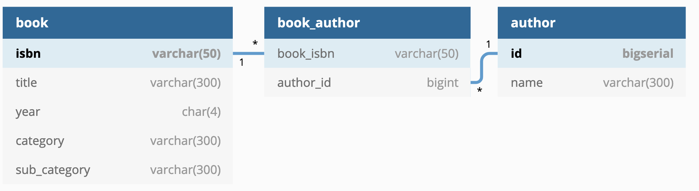

# Two Table Database

Date: Sun Sep 29 06:32:35 CEST 2019

## Milestone

0.1.0

## Context

For the project a database structure need to be chosen and adopted.

## Decision

Two table database will be used as this point:



```
Table books {
  isbn varchar(50) [pk]
  title varchar(300)
  year char(4)
  category varchar(300)
  sub_category varchar(300)
}

Table authors {
  isbn varchar(50) [ref: > books.isbn]
  name varchar(300)
}
```

## Consequences

Why:

- Simple
- Clean

Why not:

- All could be combined in one table.
